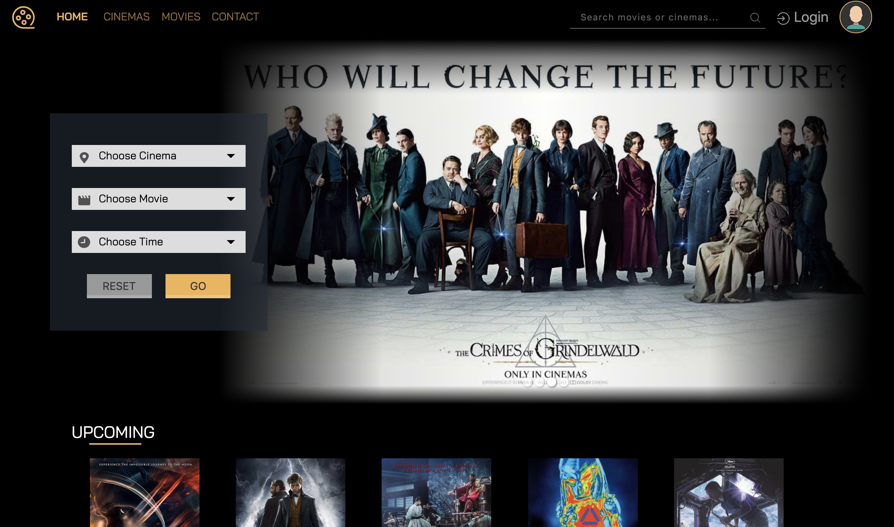

# Luna

Luna is a movie ticket booking website that simulates the online business operation of a movie theatre company based in Singapore. Frontend-wise, all fancy components are implemented with vanilla HTML/JS/CSS and they are responsive. The backend is written in PHP. Below is the index page.

### Functionalities
- View cinemas/movies/showtimes
- Book cinemas/movies/showtimes/seats/snacks
- Account System
- Full-Text Search
- Etc...

### How to Run (Recommended)
- Install `XAMPP` or `MAMP`
- Start the server and database
- cd to `XAMPP/htdocs` and git clone this repository
- Go to `phpMyAdmin`, create a new user `f37ee` with password `f37ee`, also create a database `f37ee`.
- Go to `localhost` and start navigating webpages!
